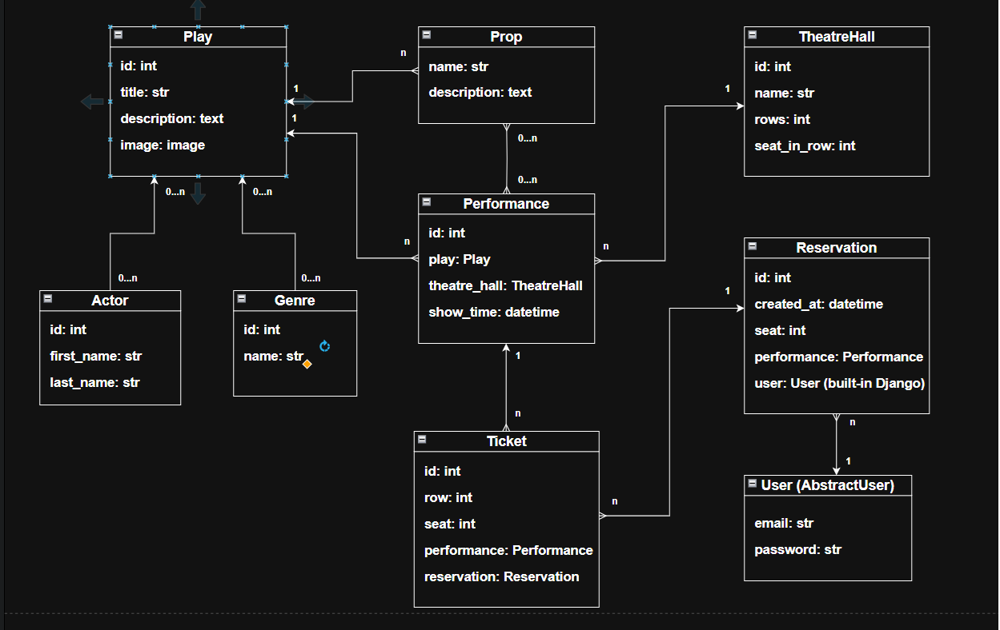

# Theatre API

## Introduction
A backend API service for theatre ticket reservations management written with Django, DRF & PostgreSQL.

## Features
### Authentication & Authorization
- User registration and login with Django’s built‑in `User` model.
  - Change `username` to `email` field, leave `password` field
- Token‑based authentication via JWT (`djangorestframework-simplejwt`).
- Role‑based access:
  - Regular users can only see their own reservations.
  - Admin/superusers can view all reservations.
### Database & ORM
- Models for `Play`, `Performance`, `TheatreHall`, `Reservation`, `Ticket`, `Actor`, `Genre`, `Prop`.
- Relationships:
  - FKs: `Performance` → `Play`, `Performance` → `TheatreHall`, `Ticket` → `Performance`, `Ticket` → `Reservation`.
  - M2M: `Play` ↔ `Actor`, `Play` ↔ `Genre`, `Performance` ↔ `Prop`.
- Constraints:
  - `unique_together` on (row, seat, performance) for tickets.
  - Validation logic ensuring seat/row ranges match the hall capacity.
- Image upload via `/upload-image/`
### Business Logic
- Reservation creation automatically ties to the authenticated user (`perform_create`).
- Ticket validation at multiple levels:
  - Serializer validation (user‑friendly errors with `400 Bad Request`).
  - Model validation (`clean` + `full_clean` raise `ValidationError`).
  - Database constraint enforcement.
- Automatic calculation of available seats via annotations.
### API Layer (Django REST Framework)
- ViewSets for `Performance` and `Reservation`.
- Nested serializers for related objects (tickets, plays, halls, props).
- Optimized queries with `select_related` and `prefetch_related` to avoid N+1 problems and Cartesian Product.
- Filtering by `date` and `play` for performances.
- Filtering plays by title, genre and actor.
### Testing
- Unit tests with Django’s `TestCase` and DRF’s `APIClient`.
- 100% Test Coverage.
- Validation of serializer outputs against expected data.
### Developer Experience
- Swagger Documentation: Endpoints are documented.
- Dockerized environment with Postgres backend.
- VS Code integration for test discovery and debugging.
- Environment variables managed via .env for clean credential handling.

* Admin panel via `/admin/`
* Pagination reservations

## Installing with GitHub
Install PostgreSQL and create a database.
There is env.example file to see how to set environment variables.

  ```bash
  git clone https://github.com/dkibalenko/theatre-api-service-mate.git
  cd theatre-api-service-mate
  python3 -m venv env
  source venv/Scripts/activate
  pip install -r requirements.txt
  set POSTGRES_DB
  set POSTGRES_USER
  set POSTGRES_HOST
  set POSTGRES_PORT
  set POSTGRES_PASSWORD
  set DJANGO_SECRET_KEY
  python manage.py migrate
  python manage.py runserver
  ```

## Running with Docker
  * Copy .env.sample to .env and populate it with your environment variables

  ```bash
  docker compose build
  docker compose up
  ```
  * Bash into your Django container with backend app
  ```bash
  docker exec -it <your_django_container_name> bash
  ```

  * Populate the database & Run the `createsuperuser` Command:
  ```bash
  python manage.py loaddata sample_fixture.json
  python manage.py createsuperuser
  ```

## Getting access
  * Get access token via ```/api/user/token/```
  * Enter Test User credentials

## Test User
* Email: admin@admin.com
* Password: admin

## Contributing
* Fork the repository
* Create a new branch (`git checkout -b <new_branch_name>`)
* Commit your changes (`git commit -am 'message'`)
* Push the branch to GitHub (`git push origin <new_branch_name>`)
* Create a new Pull Request

## **Database Schema**

